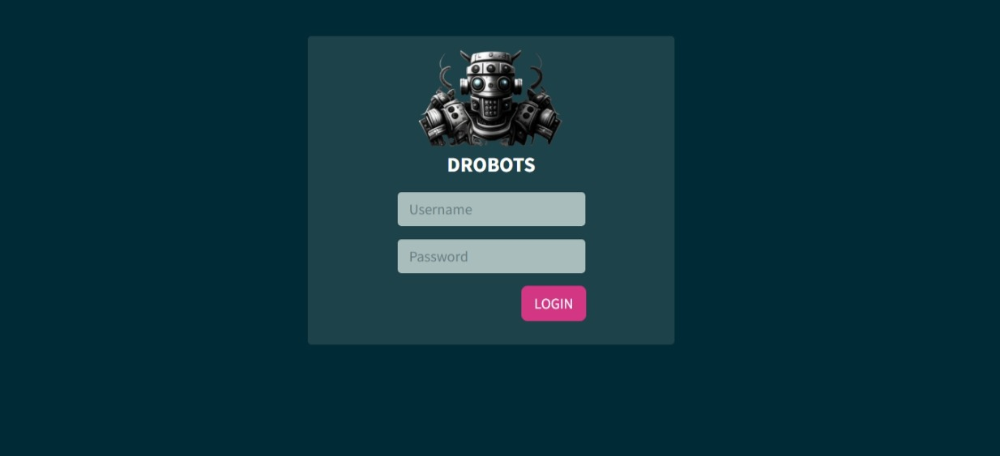
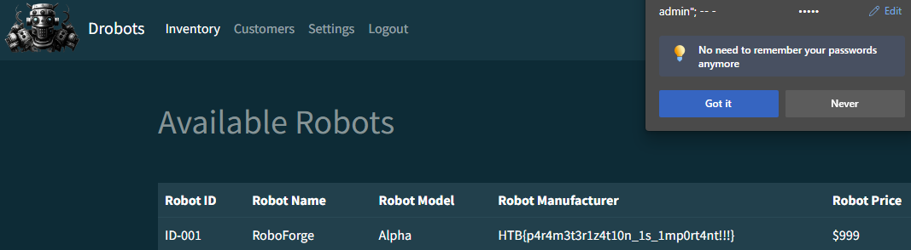

# The Cursed Mission: Infiltrating Drobots — Unveiling a Web of Deceit

> [!NOTE]
> If you encounter any problems creating a Docker container, use the custom [Dockerfile](Dockerfile) where I addressed the issue with MySQL client environment variables.

<details>
<summary><b>Table of Contents</b></summary>

- [The Cursed Mission: Infiltrating Drobots — Unveiling a Web of Deceit](#the-cursed-mission-infiltrating-drobots--unveiling-a-web-of-deceit)
  - [Legend](#legend)
  - [Login Form](#login-form)
  - [SQL Injection](#sql-injection)
  - [Code Review](#code-review)
  - [Mitigation](#mitigation)
  - [Lessons](#lessons)

</details>

## Legend

Pandora's next mission, as part of her reconnaissance training, was to infiltrate the Drobots firm suspected of engaging in illegal activities. As you can guess, I went with her [in case she got locked in a room again](https://github.com/samaellovecraft/ctf-write-ups/tree/main/HTB/Cyber%20Apocalypse/2023/Web/Trapped%20Source).

## Login Form

Having stealthily entered the building and ensuring we weren't being trailed, we proceeded to infiltrate the internal network. Beyond the ventilation shaft, our next access point cyberialized in the form of a login page on a locally running website:



## SQL Injection

As a hacker, there's a peculiar fondness for money-driven criminals-they're so easy to hack sometimes. The thing is, their insatiable greed blinds them to the point where investing even a penny in cybersecurity becomes inconceivable. Case in point, this login form crumbled under the weight of the most rudimentary SQL injection, showcasing the repercussions of cutting corners on security measures:


```
admin"; -- -
```



```
HTB{p4r4m3t3r1z4t10n_1s_1mp0rt4nt!!!}
```

After that, we gathered all the evidence exposing Drobots' illicit activities and transmitted it to the Intergalactic Ministry of Spies. As we stand on the brink of the unknown, awaiting [the next chapter in our Cursed Mission](), the weight of what we've uncovered lingers in the air, promising more challenges on the horizon!

## Code Review

Now it's time to examine the source code and consolidate our knowledge. What? Oh, don't worry, I borrowed the code temporarily for a rigorous testing session. All in the name of science, of course! After all, with Pandora being an archaeologist, she can certainly vouch for the pursuit of knowledge, even if it involves borrowing a few lines of code for a scientific investigation.

The vulnerability resides within the `login` function implemented in the `database.py` file:

```python
def login(username, password):
    user = query_db(f'SELECT password FROM users WHERE username = "{username}" AND password = "{password}" ', one=True)

    if user:
        token = createJWT(username)
        return token
    else:
        return False
```

The issue arises from the usage of _string interpolation_ in the SQL query, leaving the application susceptible to SQL Injection attacks. Sounds crazy, right? Let me explain! Imagine if you were trying to create a sentence by gluing words together without making sure they fit logically. In the same way, this code is combining pieces of a query without proper checks, creating an opening for potential attacks.

## Mitigation

To mitigate this security risk, we can use a technique called _query parameterization_. In simpler terms, it's like using a protective shield around the user inputs. Here's an example of how the login function could be modified to use parameterization:

```python
def login(username, password):
    # Using query parameterization to prevent SQL Injection
    query = 'SELECT password FROM users WHERE username = ? AND password = ?'
    user = query_db(query, (username, password), one=True)

    if user:
        token = createJWT(username)
        return token
    else:
        return False
```

The `?` placeholders are used in the query, and the actual values are provided separately as a tuple. This approach helps prevent SQL Injection attacks by ensuring that **user inputs are treated as data, not executable code**.

As you can see, with the application of this security measure, my previous SQLi payload is rendered ineffective in bypassing the login page:


## Lessons

- SQL Injection is _one of the most dangerous_ web vulnerabilities. Always be aware of the risks associated with SQLi and implement [secure coding practices to prevent such attacks](https://cheatsheetseries.owasp.org/cheatsheets/SQL_Injection_Prevention_Cheat_Sheet.html). The most recommended approach involves the implementation of [parameterized queries](https://cheatsheetseries.owasp.org/cheatsheets/Query_Parameterization_Cheat_Sheet.html).
- Unsecured login forms are like candy stores for hackers, and we're the kids with a sweet tooth. Just remember, securing your code is cheaper than dealing with intergalactic hackers on a sugar rush!
