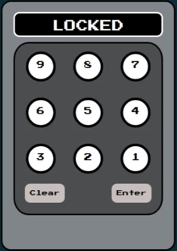
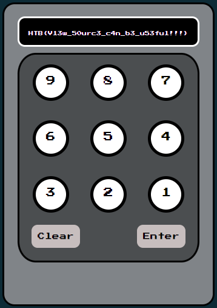
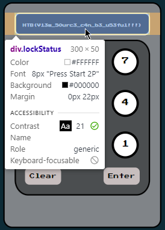
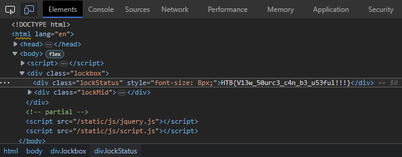

# The Cursed Mission: HTML Heist — Pandora's Escape

## Legend

An urgent message from the Intergalactic Ministry of Spies flashed across my screen:

> _"We tested Pandora's movement and intelligence abilities. She found herself locked in a room with no apparent means of escape. Her task was to unlock the door and make her way out. Can you help her in opening the door?"_

Typical Pandora, I thought. Always finding trouble... or does trouble find her?

## Mission

As her backup agent, I had to help her get out of the room. I hacked into the security system and discovered a PIN panel controlling the door:

<p align="center">
  
</p>

Time was ticking. But before resorting to brute force, I decided to look deeper. There's always a hidden clue if you know where to look.

With a swift `Ctrl+U`, the source code unveiled itself. The PIN was right there, hiding in plain sight:

```html
<script>
	window.CONFIG = window.CONFIG || {
		buildNumber: "v20190816",
		debug: false,
		modelName: "Valencia",
		correctPin: "8291",
	}
</script>
```

I punched in 8-2-9-1, and **voilà!** The flag appeared on the screen:

<p align="center">
  
</p>

But wait, it wasn't selectable! How could I copy it?

Time to unleash the secret weapon: **The Mighty Power of Developer Tools**! A quick `F12`, followed by `Ctrl+Shift+C` to inspect an element on the page:

<p align="center">
  
</p>

Clicking on the panel screen revealed the flag in the HTML code:

<p align="center">
  
</p>

```
HTB{V13w_50urc3_c4n_b3_u53ful!!!}
```

I swiftly copied the flag, pasted it in, and... what a great escape! The door swung open, and Pandora dashed out with a mix of annoyance and relief on her face. _"Thanks for saving my ass... again,"_ she muttered, and [we continued to carry out our Cursed Mission](https://github.com/samaellovecraft/ctf-write-ups/tree/main/HTB/Cyber%20Apocalypse/2023/Web/Gunhead)!

## Lessons

- Viewing the source code can reveal useful information.
- Developer tools can give you **The Ultimate Power of HTML Control**!
- Teamwork is essential for successful missions.
