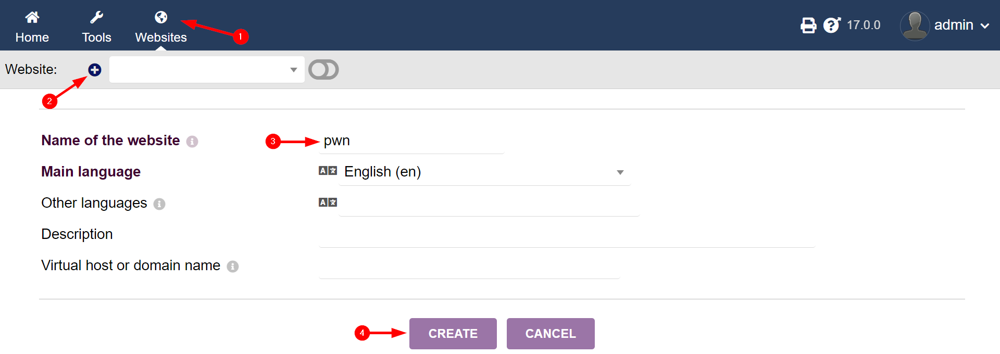

# BoardLight

<details>
<summary><b>Table of Contents</b></summary>

- [BoardLight](#boardlight)
  - [Overview](#overview)
  - [Network Enumeration](#network-enumeration)
  - [Web Enumeration](#web-enumeration)
    - [Discovering Domain Name](#discovering-domain-name)
    - [Vhost Enumeration](#vhost-enumeration)
    - [Walking an Application](#walking-an-application)
      - [crm.board.htb](#crmboardhtb)
  - [Foothold](#foothold)
    - [Manually Exploiting RCE in Dolibarr (CVE-2023-30253)](#manually-exploiting-rce-in-dolibarr-cve-2023-30253)
  - [PrivEsc](#privesc)
    - [Dolibarr Configuration](#dolibarr-configuration)
    - [MySQL](#mysql)
    - [Password Reuse](#password-reuse)
    - [SUID Enumeration](#suid-enumeration)

</details>

## Overview

> - [Machine Link](https://app.hackthebox.com/machines/BoardLight)
> - [Medium Story](https://medium.com/@samaellovecraft/hack-the-box-boardlight-walkthrough-f3949e54c71a)

During my assessment of the BoardLight environment, I discovered that the production CRM system utilized **default credentials**, facilitating the identification and exploitation of an authenticated **Remote Code Execution (RCE)** vulnerability in the Dolibarr CRM ([CVE-2023-30253](https://nvd.nist.gov/vuln/detail/CVE-2023-30253)), which allowed me to gain initial access. Following this, I investigated configuration files and discovered MySQL credentials, revealing a case of **password reuse** with the `larissa` account. This led to further privilege escalation through the identification of a critical **Local Privilege Escalation (LPE)** vulnerability in the Enlightenment software ([CVE-2022-37706](https://nvd.nist.gov/vuln/detail/CVE-2022-37706)). By leveraging these vulnerabilities and misconfigurations, I successfully escalated privileges and ultimately gained root access to the machine.

## Network Enumeration

```bash
sudo rustscan -a $IP -r 0-65535 -- -A -Pn -oN enumeration/tcp.all.nmap
```


The results of the TCP scan are pretty boring. Only ports 22 and 80 are open. Since the HTTP server doesn't redirect to a domain name, I decided to explore the website first instead of guessing blindly.

## Web Enumeration

### Discovering Domain Name


Nothing unusual here—a simple website for a cybersecurity consulting firm.

The backend is powered by Apache and PHP:


Of particular interest is a contact form:


However, since I didn't find any authentication portals, testing for XSS isn't relevant here. It's just a landing page.

But in the footer, I found a domain name, which allows me to start enumerating possible subdomains, as this page doesn't seem to offer much in terms of exploitation opportunities.


### Vhost Enumeration

To enumerate potential virtual hosts, I used `ffuf` with the following command:

```bash
ffuf -c -u http://board.htb -H 'Host: FUZZ.board.htb' -ic -w /usr/share/seclists/Discovery/DNS/subdomains-top1million-110000.txt -mc all -fs 15949
```


As a result, I discovered `crm.board.htb`, which hints at a CRM (Customer Relationship Management) system.

### Walking an Application

#### crm.board.htb

After navigating to the newly discovered subdomain, I was greeted by a login form that gracefully disclosed both the technology and its version:


The CRM is powered by Dolibarr 17.0.0. I was able to access the dashboard using the default credentials:

```
admin:admin
```

It's not uncommon for developers to forget to change default credentials in production environments, leaving applications vulnerable to unauthorized access.


After conducting some research, I quickly found that this version of Dolibarr is vulnerable to **remote code execution (RCE)** via [CVE-2023-30253](https://nvd.nist.gov/vuln/detail/CVE-2023-30253). This vulnerability allows an authenticated user to execute arbitrary code by using `<?PHP` instead of `<?php` in the injected code.

## Foothold

### Manually Exploiting RCE in Dolibarr (CVE-2023-30253)

To manually achieve remote code execution, you first need to create a website by visiting the following URL:

```
http://crm.board.htb/website/index.php?action=createsite
```



Next, create a page for this website where the code will be injected:


Then, modify the page's HTML source by injecting malicious PHP code, starting with `<?PHP`:


Any PHP code will work. I chose to go with the good old [reverse shell from pentestmonkey](https://github.com/pentestmonkey/php-reverse-shell/blob/master/php-reverse-shell.php):


Finally, trigger the reverse shell using the preview button:


I'm in!

## PrivEsc

### Dolibarr Configuration

To escalate privileges, I started by checking the Dolibarr configuration files for any sensitive information:

```bash
cat /var/www/html/crm.board.htb/htdocs/conf/conf.php
```


Here, I found the MySQL database credentials:

```
dolibarrowner:serverfun2$2023!!
```

### MySQL

With these credentials, I accessed the MySQL database:

```bash
mysql -u dolibarrowner -p -h localhost -P 3306 dolibarr
```


Then, I queried the user table to find stored credentials:

```sql
select login, pass, pass_encoding, pass_crypted, pass_temp from llx_user;
```


The `llx_user` table revealed password hashes for two users, which I immediately began cracking with Hashcat:

```powershell
.\hashcat.exe -m 3200 -a 0 .\mysql.hashes ..\rockyou.txt --username
```

Since bcrypt is notoriously slow to crack, I decided to check if the database password was reused elsewhere while the brute-force process was ongoing.


### Password Reuse

It turned out to be much simpler than cracking hashes. Apart from the `root` user, there was another user on the machine, `larissa`, and I successfully gained access using the previously obtained password:


Password reuse is a serious security risk; if users use the same password across multiple accounts, a breach in one service can lead to unauthorized access in others.

### SUID Enumeration

Since `larissa` didn't have `sudo` privileges, I decided to check for low-hanging fruit by enumerating SUID binaries:

```bash
find / -type f -a \( -perm -u+s -o -perm -g+s \) -exec ls -l {} \; 2> /dev/null
```


Right away, I spotted some non-standard binaries related to `enlightenment`. A quick search revealed that this is software commonly used for window management. I then checked its version:


It didn't take long to find a critical vulnerability. This version is vulnerable to [CVE-2022-37706](https://nvd.nist.gov/vuln/detail/CVE-2022-37706), which allows **Local Privilege Escalation (LPE)**—this time with a [handy PoC exploit](https://github.com/MaherAzzouzi/CVE-2022-37706-LPE-exploit)!

The intricate workings of this vulnerability are beyond the scope of this challenge, but the exploit author did an excellent job of enlightening the path he took to discover this 0-day, so be sure to check it out.


Yikes, they made me use nano! 🤮

And with that, the target is compromised. If you found this walkthrough at least somewhat helpful or interesting, consider [giving me some respect on Hack The Box](https://app.hackthebox.com/profile/1007130) or just [leave a clap](https://medium.com/@samaellovecraft/hack-the-box-boardlight-walkthrough-f3949e54c71a) below!
