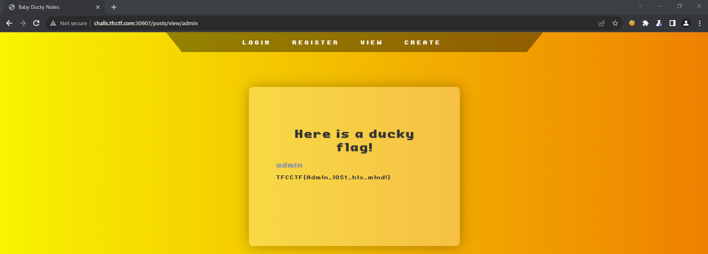

# Baby Ducky Notes

## Code Review

After carefully examining the source code of the application, I discovered that the `/posts/view/<user>` endpoint does not have any checks in place to prevent Insecure Direct Object Reference (IDOR) vulnerability. This can be seen in the following code snippet from the `routes.py` file:

```python
@web.route('/posts/view/<user>', methods=['GET'])
@auth_required
def posts_view(username, user):
    try:
        posts = db_get_user_posts(user, username == user)
    except:
        raise Exception(username)

    return render_template('posts.html', posts=posts)
```

In this code, the `posts_view` function retrieves posts from the database using the `db_get_user_posts` function. However, there is **no proper access control check** to verify that the user accessing the requested posts is the rightful owner. As a result, a malicious actor can exploit this vulnerability to gain **unauthorized access to posts belonging to other users**.

## Exploitation

To validate this vulnerability, I navigated to the `/posts/view/admin` endpoint and was able to read posts belonging to the `admin` user as well as retrieve the flag:



```
TFCCTF{Adm1n_l0St_h1s_m1nd!}
```

## Mitigation

To mitigate this security flaw, it is crucial to implement proper access control checks to ensure that users can only access their own posts. This can be done by adding additional logic to the `posts_view` function to verify that the `user` parameter matches the authenticated user's username before granting access to the posts:

```python
@web.route('/posts/view/<user>', methods=['GET'])
@auth_required
def posts_view(username, user):
    # Check if the authenticated user matches the requested user
    if username == user:
        try:
            posts = db_get_user_posts(user, True)
        except:
            raise Exception(username)

        return render_template('posts.html', posts=posts)
    else:
        # If the requested user is different from the authenticated user, deny access
        return "Access Denied: You are not authorized to view this user's posts.", 403
```
